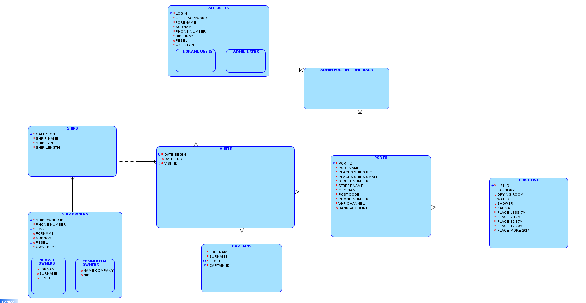
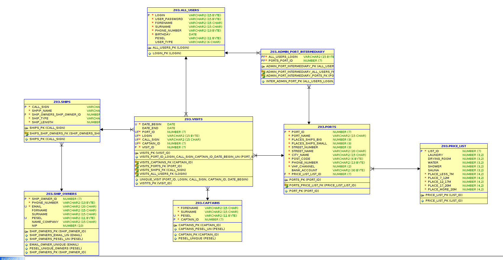

# SeaSupPort

## Skład zespołu

- [Ewa Miazga](https://gitlab-stud.elka.pw.edu.pl/emiazga)
- [Mikołaj Taudul](https://gitlab-stud.elka.pw.edu.pl/mtaudul)
- [Bartłomiej Niewiarowski](https://gitlab-stud.elka.pw.edu.pl/bniewiar)
- [Michał Jakomulski](https://gitlab-stud.elka.pw.edu.pl/mjakomul)

## Cel projektu

Celem projektu jest stworzenie aplikacji desktopowej obsługującej polskie porty morskie. Aplikacja będzie umożliwiała użytkownikowi sprawdzenie listy portów, rezerwacji wolnego miejsca i dodawanie swojego jachtu. A administratorzy portów będą mieli możliwość m.in. zarządzania rezerwacjami.


## Podstawowe założenia aplikacji

- Aplikacja będzie wymagała zalogowania się przez użytkownika.
- Użytkownicy będą podzieleni na administratorów portów i zwykłych użytkowników (żeglarzy).
- Będzie możliwość dodania swojego jachtu i podania jego szczegółowych informacji.
- W aplikacji będzie lista działających polskich portów morski.
- Aplikacja będzie posiadała szczegółowe informacje o portach, a także umożliwi sprawdzenie i rezerwacje miejsca w porcie.


## Priorytety projektu

- Stworzenie intuicyjnego oraz przyjaznego dla użytkownika interfejsu graficznego.
- Baza danych zgodna ze standardami modelu relacyjnego. 
- Budowa aplikacji przystosowana do późniejszego rozwoju i dodania kolejnych modułów.


## Instalacja i uruchomienie aplikacji

Do zainstalowania aplikacji potrzebny będzie Maven zainstalowany na własnym komputerze.
Pobierabmy wszystkie pliki z repozytorium.

Kompilujemy kod i zasoby za pomocą komend
```
mvn compiler:compile
mvn resources:resources
```
Uruchamiamy aplikację
```
mvn javafx:run
```

## Wstępna deklaracja wybranej technologii

- Interfejs graficzny: JavaFX.
- Narzędzie do kontroli wersji: git
- Baza danych: Oracle Database
- Narzędzie do budowania aplikacji: Maven
- Testy jednostkowe: JUnit
- Łączenie się z bazą danych z poziomu aplikacji: do uzgodnienia
- Dokumentacja: JavaDoc


## Model relacyjny bazy danych



## Model logiczny bazy danych




## Workflow

```
seasupport
   ├ App
     └ src
       └ main
         └ java
           ├ app
           ├ appActions
           └ logic
         └ resources
       └ test/java/src
         ├ app
         ├ appActions
         └ logic
   ├ db_scripts
   └ doc
```

## Gitflow
Repozytorium powinno być budowane według systemu zarządzania gałęziami gitflow:

```
main
  ├ feature-styling-dialogs
  ├ feature-branch-logic
  ...
  └ feature-database-connection
```

Praca na repozytorium:
1. Stwórz nową gałąź:
```
git checkout -b feature-new-branch
```
2. Praca nad nową funkcjonalnością:
  Dodaj zmienione pliki do repozytorium:
```
git add <files>
```
  Zapisz poczynione zmiany:
```
git commit -m  "message"
```
3. Zaaktualizuj ścieżkę commitów:
```
git rebase origin main
```
4. Wyślij zmiany:
```
git push
```
5. Zmień branch na main:
```
git checkout main
```
6. Pobierz nowe zmiany:
```
git pull
```
7. Otwórz merge request w gitlabie

## Spis Treści

<!-- AUTOGENERATED TOC -->

1.	[Frequently Asked Questions](#frequently-asked-questions)
	1.	[Spis Treści](#Spis-treści)
	2.	[Pytania ogólne](#Pytania-ogólne)
		1.	[Jak sktuczenie uruchomić aplikację?](#Jak-skutecznie-uruchomić-aplikację?)
  3.  [Dla kogo przeznaczona jest aplikacja?](#Dla-kogo-przeznaczona-jest-aplikacja?)
  4.  [Użytkowanie aplikacji](#Użytkowanie aplikacji)
    1.  [Logowanie](#Logowanie)
    2.  [Rejestracja](#Rejestracja)
    3.  [Wybór portu](#Wybór-portu)
    4.  [Rezerwacja miejsca](#Rezerwacja-miejsca)
        1. [Nowa wizyta](#Nowa-wizyta)
        2. [Dodaj statek](#Dodaj-statek)
        3. [Dodaj właściciela](#Dodaj-właściciela)
        4. [Dodaj kapitana](#Dodaj-kapitana)
    5.  [Zmiana danych użytkownika](#Zmiana-danych-użytkownika)
    6.  [Odwołanie wizyty](#Odwołanie-wizyty)

# Frequently Asked Questions

## Pytania ogólne

### Jak sktuczenie uruchomić aplikację?

## Dla kogo przeznaczona jest aplikacja?

Aplikacja została stworzona z myślą o żeglarzach, dzięki niej jesteś w stanie zarezerwować wizyte, sporawdzić informacje o porcie oraz porównać dostępność i ceny oferowanych usług.

##Użytkowanie aplikacji

### Logowanie

Aby zalogować się do aplikacji użyj swojego loginu oraz hasła, po podaniu poprawnych danych logowania zostaniesz przeniesiony do okna wyboru portu, bądź do widoku portu w którym aktualnie jesteś.

### Rejestracja

W celu rejestracji uzupełnij dane rejestracji, pamiętaj że każda kolumna w formluarzu musi być uzupełniona, jeśli wybrany login jest już zajęty zmień go na taki który nie został użyty do tej pory.

### Wybór portu

Jeśli znajdujesz się w oknie wyboru portu, wybierz port który Cię interesuje, po wybraniu portu zostaniesz przeniesiony do widoku portu w którym można uzyskać informacje o porcie oraz zarezerwować miejsce na wybrany przez nas termin.

### Rezerwacja miejsca

Aby zarezerować miejsce w widoku portu przejdź do OpenDocksDialog, następnie zadekleruj długość twojej jednostki i przejdź do rezerwacji.

#### Nowa wizyta

Formularz nowej wizyty wymaga od użytkownika podania daty początkowej oraz końcowej naszej wizyty, idetyfikatora statku oraz kapitana, jeśli chcesz dodać nowy statek bądź nowego kapitana wybierz odpowiednią opcję i przejdź do nowego okna. Pamiętaj, że w wybranym terminie nie możesz mieć zarezerwowanej żadnej innej wizyty.

#### Dodaj statek

Aby dodać nowy statek wpisz do formularza callSign jednostki który jest jej identyfikatorem, nazwę, długość oraz typ statku. Dodatkowo podaj identyfikator kapitana jednostki. Aby dodanie statku przebiegło pomyślnie w bazie aplikacji nie może znajdować się statek o podanym callSign.

#### Dodaj właściciela

W celu dodania nowego właściciela do bazy aplikacji podaj wymagane dane, pamiętaj że numer pesel oraz adres email są danymi unikalnymi, nie może być dwóch właścicieli o takim samym peselu bądź adresie email.

#### Dodaj kapitana

Aby dodać kapitana należy podać wypisane w formluarzu dane, jeśli to Ty jesteś kapitanem podczas nowej wizyt odznacz tą opcję w aplikacji, usprawni to proces dodania kapitana i zapewni poprawność wszystkich danych.

### Zmiana danych użytkownika

W celu zmiany naszych danych przejdź do okna AccountDetalis, zmień dane które Cię interesują i wróć poprzedniego widoku.

### Odwołanie wizyty

Aby odwołać stworzoną już wizytę przejdź z poziomu okna AccountDetails do widoku VisitsDetalis, jeśli wizyta już się rozpoczęła to data zakończenia wizyty zostanie zmieniona na aktualną datę, w sytuacji gdy odwołamy wizytę która rozpocznie się w przyszłości to wizyta zostanie usunięta i nie zacznie się juz w dniu startu.
