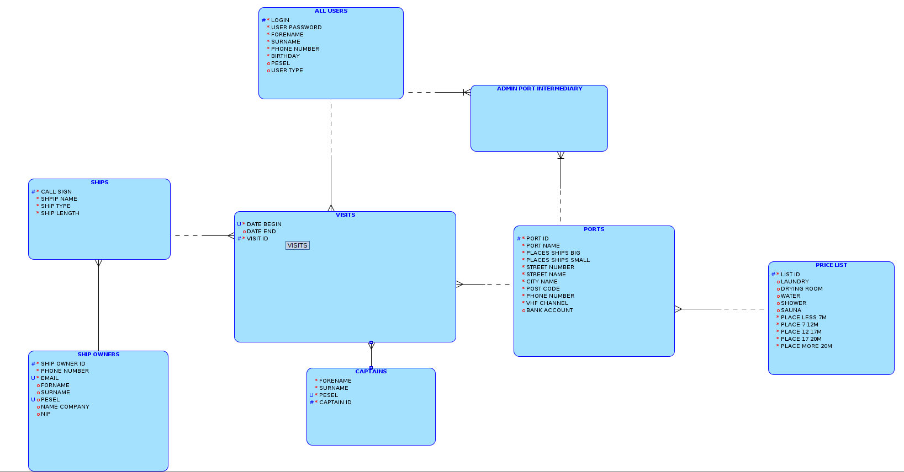

# SeaSupPort


## Cel projektu

Celem projektu jest stworzenie aplikacji desktopowej obsługującej polskie porty morskie. Aplikacja będzie umożliwiała użytkownikowi sprawdzenie listy portów, rezerwacji wolnego miejsca i dodawanie swojego jachtu. A administratorzy portów będą mieli możliwość m.in. zarządzania rezerwacjami.


## Podstawowe założenia aplikacji

- Aplikacja będzie wymagała zalogowania się przez użytkownika.
- Użytkownicy będą podzieleni na administratorów portów i zwykłych użytkowników (żeglarzy).
- Będzie możliwość dodania swojego jachtu i podania jego szczegółowych informacji.
- W aplikacji będzie lista działających polskich portów morski.
- Aplikacja będzie posiadała szczegółowe informacje o portach, a także umożliwi sprawdzenie i rezerwacje miejsca w porcie.


## Priorytety projektu

- Stworzenie intuicyjnego oraz przyjaznego dla użytkownika interfejsu graficznego.
- Baza danych zgodna ze standardami modelu relacyjnego. 
- Budowa aplikacji przystosowana do późniejszego rozwoju i dodania kolejnych modułów.


## Skład zespołu

Ewa Miazga, Bartłomiej Niewiarowski, Michał Jakomulski, Mikołaj Taudul


## Wstępna deklaracja wybranej technologii

- Interfejs graficzny: JavaFX.
- Narzędzie do kontroli wersji: git
- Baza danych: Oracle Database
- Narzędzie do budowania aplikacji: Maven
- Testy jednostkowe: JUnit
- Łączenie się z bazą danych z poziomu aplikacji: do uzgodnienia
- Dokumentacja: JavaDoc


## Model relacyjny bazy danych


## Model logiczny bazy danych




## Workflow

```
seasupport
   ├ app
   │  └ src
   └ doc
```
